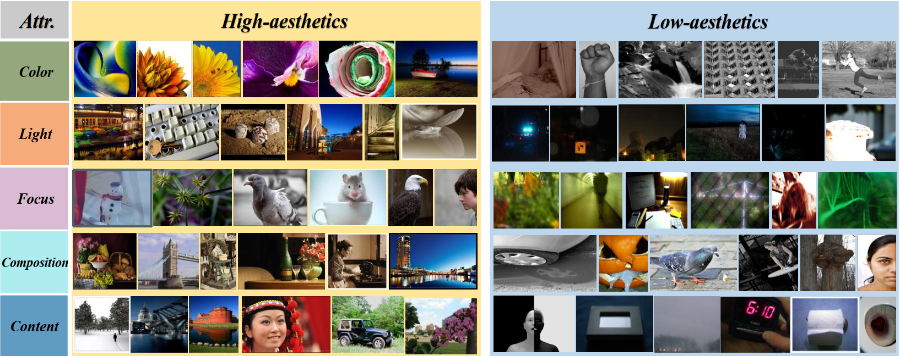

# AesCLIP: Multi-Attribute Contrastive Learning for Image Aesthetics Assessment

This directory contains the source code and weights for the ACM MM 2023 paper:
["AesCLIP: Multi-Attribute Contrastive Learning for Image Aesthetics Assessment"](https://dl.acm.org/doi/abs/10.1145/3581783.3611969).

## 👨‍💻 Todo
- [x] Training code for AesCLIP based on AVA-comments database
- [x] Evaluation code for IAA task
- [x] Usage example of AesCLIP
- [x] Checkpoints of AesCLIP

## 🛠️ Usage
### Prerequisite

Install dependencies (works with python3.9):

```
pip3 install -r requirements.txt
```
### How to use

The model checkpoints and pretrained data can be downloaded from 
[gcloud directory link](https://drive.google.com/drive/folders/1kSjpyfBGL0k4bs2lkyL9HFVzcLZWGdKY).
The folder contains the following items:

-   **./AesCLIP/checkpoints/AesCLIP_pretrain/**: AesCLIP model weight, which fine-tuned vanilla CLIP on aesthetic database.
-   **./AesCLIP/checkpoints/AesCLIP_IAA_tuned/**: AesCLIP for IAA task, finetuned AesCLIP on AVA database for aesthetic distribution prediction.
-   **./AesCLIP/data/**: Pretrained data for AesCLIP.

```python
import torch
from PIL import Image
import models.clip as clip
from models.aesclip import zs_AesCLIP

zs_model = zs_AesCLIP(clip_name='ViT-B/16', weight='./pretrained_weights/AesCLIP')
device = torch.device("cuda:0" if torch.cuda.is_available() else "cpu")

_, preprocess = clip.load('ViT-B/16', device)
image = Image.open('img/example.jpg').convert("RGB")
image_input = preprocess(image).unsqueeze(0).to(device)

with torch.no_grad():
    zs_aes_score = zs_model(image_input, ['good image', 'bad image'])[0].item() * 10

print('Predicted Aesthetic Score: ', zs_aes_score)
```

### Run command

Example command for running AesCLIP to predict aesthetic scores (both finetuned and zero-shot).

```shell
python demo.py
```

Example command for running AesCLIP model for IAA task on AVA database.

```shell
python eval/eval_ft.py
```

Example command for training AesCLIP on AVA-comments database.

```shell
python train/train_AesCLIP.py
```


## ⭐ Demos
### AesCLIP for assessing aesthetic attributes. 


## 💡 Citation

If you find this code useful for your research, please cite our
paper:

```
@inproceedings{sheng2023aesclip,
  title={AesCLIP: Multi-Attribute Contrastive Learning for Image Aesthetics Assessment},
  author={Sheng, Xiangfei and Li, Leida and Chen, Pengfei and Wu, Jinjian and Dong, Weisheng and Yang, Yuzhe and Xu, Liwu and Li, Yaqian and Shi, Guangming},
  booktitle={Proceedings of the 31st ACM International Conference on Multimedia},
  pages={1117--1126},
  year={2023}
}
```
